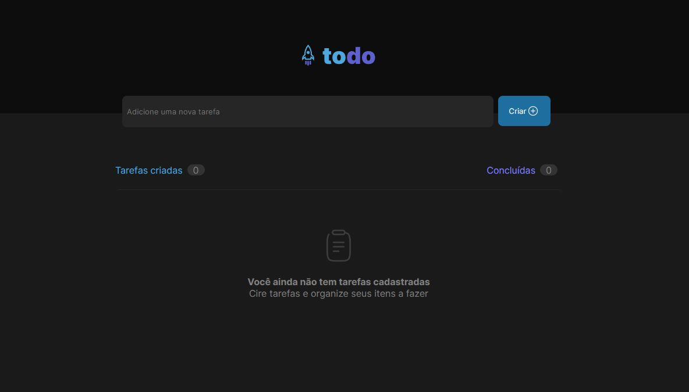

# The App




## How this app would help you?

- Organizing your tasks;
- You can broak a big task in others small than tasks to facilitate to see a biggest problem;
- Controll all tasks;


## Mainly functionality

- You can to create tasks;
- List all tasks;
- Checked tasks completed;
- Delete tasks;


# How to install

In however folder choosed to you past:
``` bash 
git clone https://github.com/Sid5488/app-to-do-list.git
```

or unzip project.


# How to execute

- Run with yarn
  1. Install all dependencies, with yarn;
  ```bash 
    yarn install
  ```
  2. Run project;
  ```bash 
    yarn dev
  ```
  3. Or you can run both commands together;
  ```bash 
    yarn install && yarn dev
  ```

- Run with npm
  1. Install all dependencies, with npm;
  ```bash 
    npm install
  ```
  2. Run project;
  ```bash 
    npm dev
  ```
  3. Or you can run both commands together;
  ```bash 
    npm install && npm run dev
  ```